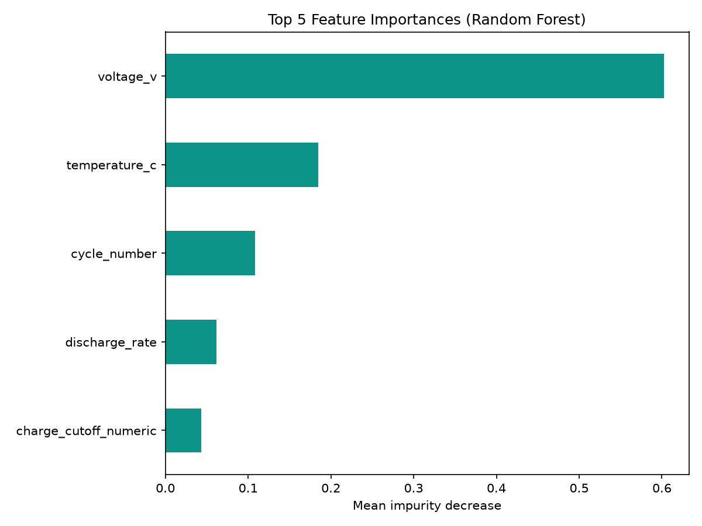

# A Machine Learning Model to Predict Energy Capacity of Lithium Cobalt Oxide Pouch Cells

**Scientific question:** Can a random forest regressor model predict discharge energy for LiCoO2 pouch cells using the CALCE Battery Accelerated Cycle Life Testing dataset? 

---

## Dataset

**Source:** CALCE Battery Research Group — CS2 Prismatic Cell Dataset  
**Citation:** Center for Advanced Life Cycle Engineering (CALCE), University of Maryland. *Battery Data.* https://calce.umd.edu/battery-data

### Accessing the data

The raw Excel files are **not included in this repository** due to size. You must download them manually:

1. Go to https://calce.umd.edu/battery-accelerated-cycle-life-testing-data
2. Dowload the Continuous Cycling Data .xlsx files
3. Extract the archive so your repo root contains the following folders:

```
Tuggle_ML_Project/
├── 001~050 Cycles/
├── 051~100 Cycles/
├── 101~150 Cycles/
│   ... (continue through)
└── 701~750 Cycles/
```

Each folder contains `.xlsx` files with per-cycle statistics and a `Global_Info` metadata sheet.

---

## Setup

### 1. Clone the repository

```bash
git clone <your-repo-url>
cd Tuggle_ML_Project
```

### 2. Create and activate the conda environment

```bash
conda env create -f environment.yml
conda activate matds
```

### 3. Download the CALCE data

Follow the [Dataset instructions](#dataset) above and place the cycle folders in the repo root before running any notebooks.

---

## Running the notebooks

Run the notebooks **in order** from the repo root:

| # | Notebook | Description |
|---|----------|-------------|
| 1 | `01_data_acquisition.ipynb` | Loads raw Excel files, inspects sheet structure, and validates cycle data |
| 2 | `02_eda_featurization.ipynb` | EDA, distribution plots, correlation heatmap, outlier review, and feature engineering |
| 3 | `03_modeling.ipynb` | Group-aware cross-validation, baseline vs. tuned model comparison, feature importance |
| 4 | `04_results_visualization.ipynb` | Parity plots, residual diagnostics, and UMAP structure-property visualization |

A consolidated version of the full pipeline is also available in `tuggle_final.ipynb`.

---

## Key Results

Models were evaluated using group-aware cross-validation to prevent data leakage across battery cells. A Ridge regression baseline was compared against a random forest model and tuned model. The standard random forest model was selected based on the R2 and MAE of the standard random forest compared to the tuned model and the unsuitability of the Ridge model based on the validation curve. Feature importance analysis identified voltage and temperature as the strongest predictors of discharge energy. 



UMAP projections of the training features show each battery cell forming a distinct curved trajectory in 2D space. Most cells remain at high discharge energy (yellow, ~7–8 Wh) throughout the majority of their cycles, with degraded cycles (orange/purple, low energy) appearing at the terminal ends of individual cell trails — visually confirming that capacity fade is a cell-specific, time-ordered process captured in the feature space. 
